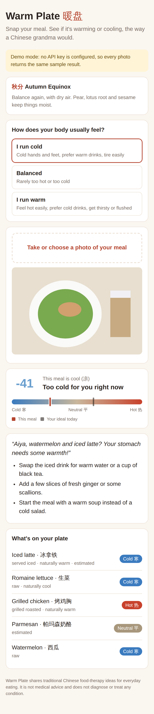
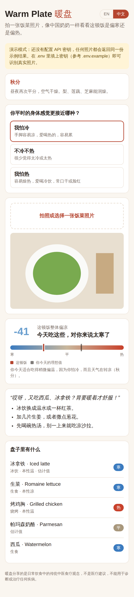

# Warm Plate 暖盘

拍一张饭菜照片，用中医食疗"寒热温凉"的视角看这顿饭偏寒还是偏热，并按你的体质和当前节气给出"中国奶奶式"建议。界面支持英文和中文，右上角切换，默认跟随浏览器语言。

| English | 中文 |
|---|---|
|  |  |

## 运行

需要 Node.js 20.12 或更高版本。

```bash
npm install
npm start          # 按 .env 里的配置调用识别接口；没配密钥时自动进入演示模式
npm run demo       # 强制演示模式：不调用 API，任何照片都返回同一份示例结果
npm test
```

打开 http://localhost:3000 。

## 配置识别接口

把 `.env.example` 复制为 `.env`，填一个提供方即可（Windows：`copy .env.example .env`）。命令行里设置的环境变量优先于 `.env`。

| 提供方 | 最少配置 | 默认模型 |
|---|---|---|
| **DeepSeek**（默认） | `DEEPSEEK_API_KEY=...` | `deepseek-v4-flash-vision-exp` |
| 任意 OpenAI 兼容接口（通义千问、OpenAI、本地服务等） | `AI_PROVIDER=openai_compatible`、`AI_BASE_URL`、`AI_MODEL`、`AI_API_KEY` | 无，必须指定 |
| Claude | `AI_PROVIDER=claude`、`ANTHROPIC_API_KEY` | `claude-opus-5` |

其他选项：

- `AI_MODEL`：覆盖任何提供方的模型名
- `AI_BASE_URL`：覆盖 DeepSeek 或 OpenAI 兼容接口的地址
- `AI_JSON_MODE=0`：接口不支持 `response_format` 时关闭 JSON 模式
- `PORT`：端口

注意：**模型必须支持图片输入**。DeepSeek 的 `deepseek-v4-flash-vision-exp` 是 2026 年 8 月上线的实验模型，普通的 `deepseek-chat` 不能看图。

## 工作原理

1. 浏览器把照片压缩到最长边 1280px，发给 `POST /api/analyze`
2. 视觉模型只负责**识别**：列出食物、烹饪方式、饮品温度、份量，并把每样食物对应到食物表里的条目。Claude 用 JSON Schema 强制输出格式；DeepSeek 等 OpenAI 兼容接口用 JSON 模式加提示词约束，返回后再逐项校验，不合法的值会被替换成安全的默认值
3. **寒热判定由本地食物表决定**（`lib/foods.mjs`），不交给模型。这样结果稳定、可复现，也方便人工校对。食物表里没有的，才用模型的估计，界面上会标 "estimated"
4. 打分（`lib/scoring.mjs`）：
   - 食物本性：寒 -2、凉 -1、平 0、温 +1、热 +2
   - 烹饪方式调整：生食 -0.5、冰镇 -1、炒/烤箱 +0.5、烧烤/油炸 +1 等
   - 饮品温度调整：冰饮 -1.5、热饮 +0.5 等
   - 按份量加权平均，得到 -100（寒）到 +100（热）的分数
5. 目标值 = 体质基准（怕冷 +0.4、平和 0、怕热 -0.3）+ 节气偏移（冬季加、盛夏减），与目标差距超过 0.5 就给出调整建议

## 文件结构

| 文件 | 作用 |
|---|---|
| `server.mjs` | HTTP 服务：静态页面、`/api/config`、`/api/analyze`（识别 + 打分）、`/api/score`（只重新打分，切换语言或体质时用，不再调用模型） |
| `lib/recognize.mjs` | 按配置选择识别提供方 |
| `lib/recognition.mjs` | 提示词、输出格式、结果校验、配置读取 |
| `lib/providers/openaiCompatible.mjs` | DeepSeek / OpenAI 兼容接口 |
| `lib/providers/claude.mjs` | Claude 接口 |
| `lib/env.mjs` | 加载 `.env` |
| `lib/foods.mjs` | 约 100 种食物的寒热属性表 |
| `lib/scoring.mjs` | 打分、体质、中英文建议文案 |
| `lib/solarTerms.mjs` | 二十四节气日期和每个节气的饮食提示 |
| `public/` | 前端页面；界面文字在 `app.js` 的 `STRINGS` 里 |
| `test/` | 单元测试（`node --test`） |

## 已知局限和下一步

- **食物表需要专业审核**：寒热分类来自常见食疗资料，不同来源对部分食物有分歧（比如芒果、番茄）。上线前应请懂中医食疗的人逐条核对
- **节气只支持北半球**，日期按常见日期近似，每年可能差一天
- **体质只分三类**，后续可以换成完整的体质问卷
- **识别效果和成本要实测**：DeepSeek 视觉模型还是实验版，建议用同一批照片对比 DeepSeek 和其他模型的识别准确率
- 还没有用户系统、历史记录和付费墙

## 合规提醒

这是生活方式类产品，不是医疗产品。页面和宣传文案都不能出现"诊断""治疗""疗效"之类的说法，页脚已有免责声明。
